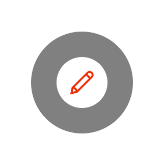
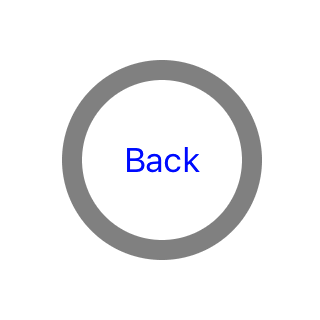

# NVZoomBounceButton
[](http://cocoadocs.org/docsets/NVZoomBounceButton/)
[](http://cocoadocs.org/docsets/NVZoomBounceButton/)
[](http://cocoadocs.org/docsets/NVZoomBounceButton)

Create zoom and bounce effect for your UIButton. Compatible with iOS 7 and higher.


## Demo

### Real Application
Try Letter Avatar at [Appstore](https://itunes.apple.com/us/app/letter-avatar/id1047376144?ls=1&mt=8)

### Screenshots
<p align="center">

</p>


## Adding NVZoomBounceButton to your project

### Cocoapods

[CocoaPods](http://cocoapods.org) is the recommended way to add NVZoomBounceButton to your project.

1. Add a pod entry for MBProgressHUD to your Podfile `pod 'NVZoomBounceButton'`
2. Install the pod(s) by running `pod install`.
3. Include NVZoomBounceButton wherever you need it with `#import <NVZoomBounceButton.h>`.

### Source files

Alternatively you can directly add the `NVZoomBounceButton.h` and `NVZoomBounceButton.m` source files to your project.

1. Download the [latest code version](https://github.com/nhuanvd/NVZoomBounceButton/archive/master.zip) or add the repository as a git submodule to your git-tracked project. 
2. Open your project in Xcode, then drag and drop `NVZoomBounceButton.h` and `NVZoomBounceButton.m` onto your project (use the "Product Navigator view"). Make sure to select Copy items when asked if you extracted the code archive outside of your project. 
3. Include NVZoomBounceButton wherever you need it with `#import "NVZoomBounceButton.h"`.

## Usage

```objective-c
self.demoBtn.tintColor = [UIColor redColor];
self.demoBtn.zoomViewColor = [UIColor whiteColor];
self.demoBtn.backgroundColor = [UIColor grayColor];

self.demoBtn.roundedCorner = YES;
self.demoBtn.zoomViewPadding = 25;
[self.demoBtn setTitle:@"Gogo" forState:UIControlStateNormal];
[self.demoBtn setImage:[UIImage imageNamed:@"icEdit"] forState:UIControlStateNormal];
```


## License

This code is distributed under the terms and conditions of the [MIT license](LICENSE). 

